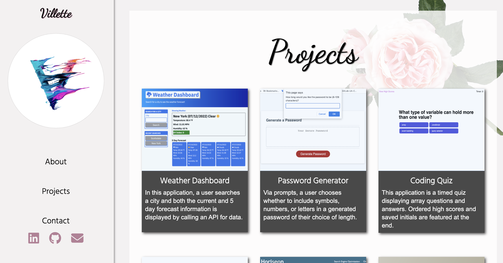

# Villlette Portfolio

## Website Description
This website contains 3 pages that are displayed via JavaScript for the about, projects and contact section. Upon clicking each button the sections are hidden or shown via functions. 

## Tasks Completed
The HTML document includes:
* a proper title and SEO metadata
* SEO optimization
* semantic labelling

The CSS document includes:
* universal variables
* features such as sidebars and drop shadows 
* Google font usage

The JavaScript document includes:
* universal variables
* event listeners
* functions to display and hide sections

## Languages
- HTML
- CSS
- JavaScript

## Links
* [Deployed webpage](https://villettejs.vercel.app/)

* [Repository](https://github.com/villette0/Portfolio-JavaScript_HTML_CSS)

## Screenshot
